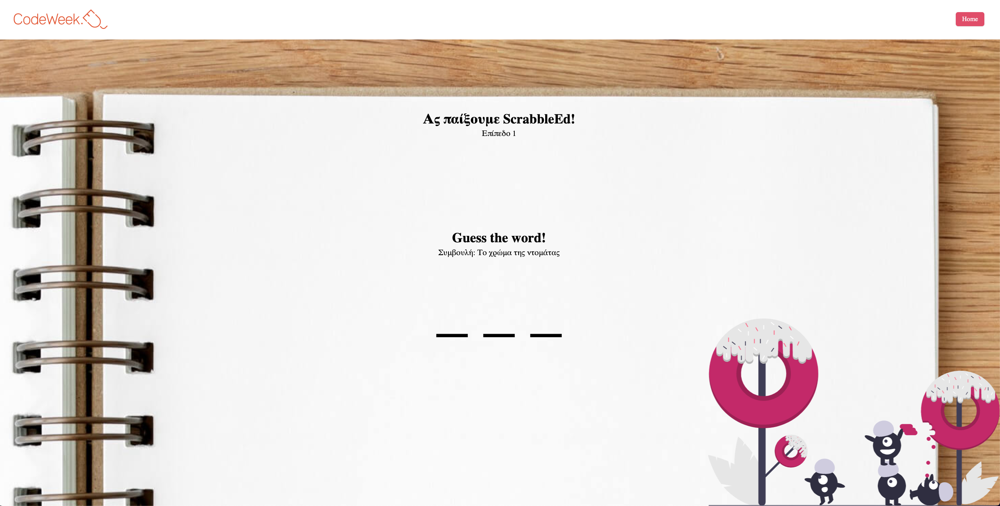

# Audiophile

<div style="display: flex">

</div>

<br>
<br>

A very simple guess-the-word game built with Next + Typescript.

Built for CodeWeek, this simple project was create to familiarize Greek elementary school students with the very basics of programming - in essence the idea of I/O, while also sharpening their knowledge of the English language.

Precisely, to progress in this game, students will have to provide input and guess the word in question. In addition, they will also be taught about mouse events, with a fun SVG animation, where the minion-like creatures are tracking the mouse movement with their eyes.

It implements lazy loading and it is based on TypeScript, React Router, Redux Toolkit, Styled Components and Framer Motion. For a detailed overview, please have a look at the [**Features**](#features) & [**Tech**](#tech) section.

**Note**: All of the image assets, along with the design files were provided by Frontend Mentor, as part of the [_Audiophile e-commerce website_](https://www.frontendmentor.io/challenges/audiophile-ecommerce-website-C8cuSd_wx) challenge.

<br>

## Installation

As this project was bootstrapped with Next, the following scripts are available:

**Install** the dependencies:

```
npm install
```

Run the app in **development** mode:

```
npm run dev
```

<br>

## <a id='features'></a>Features

- 3 difficulty levels.
- JSON-provided data with server-side rendering.
- URL-managed state.

<br>

## <a id='tech'></a>Tech

- Next
- TypeScript
- Framer Motion
- Tailwind

For a more detailed overview of the development & production dependencies, please check `package.json`.

<br>

## License

[MIT](./LICENSE.md)
